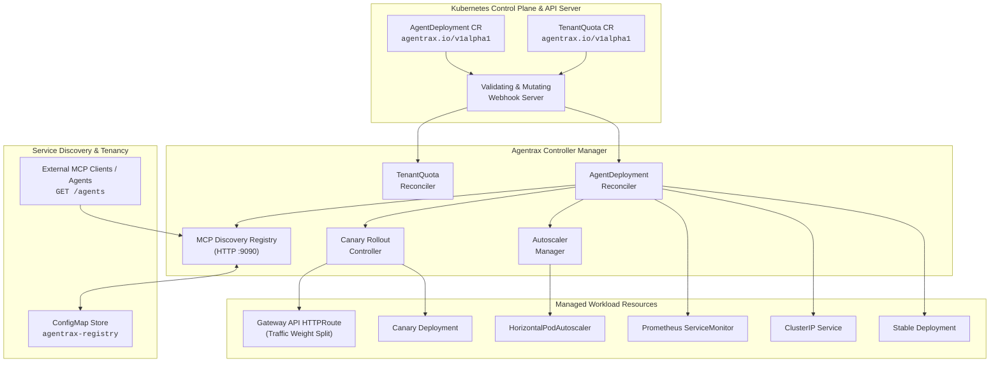

# Agentrax

[](https://github.com/gitcommitankit/agentrax/actions/workflows/ci.yml)
[](https://goreportcard.com/report/github.com/gitcommitankit/agentrax)
[](LICENSE)
[](https://kubernetes.io/)

**Agentrax** is a declarative, cloud-native Kubernetes operator designed for managing the full lifecycle of AI and LLM Agent workloads. It delivers multi-tenant resource quota admission, metrics-driven horizontal pod autoscaling, statistically gated canary progressive rollouts with automated rollback, and native Model Context Protocol (MCP) service discovery.

---

## Architecture Overview



---

## Key Features

| Feature                         | Description                                                                                                            | Key Mechanism                                                           |
| ------------------------------- | ---------------------------------------------------------------------------------------------------------------------- | ----------------------------------------------------------------------- |
| **Declarative Agent Lifecycle** | Complete deployment management, self-healing, status tracking, and graceful teardown.                                  | `AgentDeployment` reconciler + controller runtime finalizers            |
| **Multi-Tenant Quotas**         | Atomic quota admission preventing concurrent over-commit of agent instances, GPU counts, and total replicas.           | In-flight reservations + Validating Webhook + `TenantQuota` reconciler  |
| **Inference Autoscaling**       | Scale-out and scale-in driven by custom agent metrics (`queueDepth`, `gpuUtilization`) with quota ceiling enforcement. | Prometheus Adapter + native `HorizontalPodAutoscaler`                   |
| **Statistical Canary Rollouts** | Automated progressive traffic shifting with sample-size gating and Prometheus error/latency threshold rollback.        | Gateway API `HTTPRoute` weights + PromQL evaluation                     |
| **Native MCP Discovery**        | In-cluster registry with JSON-RPC 2.0 handshake validation, tool capability aggregation, and TTL heartbeat sweeps.     | In-operator HTTP Server (`:9090`) + ConfigMap persistence + TTL sweeper |

---

## Getting Started

### Prerequisites

- **Go**: `v1.22+`
- **Docker**: `v20.10+`
- **Kubernetes Cluster**: `v1.28+` (e.g., `kind`, `minikube`, or cloud provider)
- **kubectl**: `v1.28+`
- **Helm**: `v3.12+` (optional, for chart installation)

---

### Quick Installation (using Kustomize)

1. **Clone the repository:**

   ```bash
   git clone https://github.com/gitcommitankit/agentrax.git
   cd agentrax
   ```

2. **Install cluster dependencies** (cert-manager, Prometheus Operator, Gateway API CRDs, and Prometheus Adapter):

   ```bash
   make deploy-deps
   ```

   Note: Prometheus Adapter installation instructions are printed by `make deploy-deps`. Follow the displayed guidance to complete the metrics pipeline setup.

3. **Install Agentrax CRDs:**

   ```bash
   make install
   ```

4. **Deploy the Agentrax Controller Manager:**

   ```bash
   make deploy IMG=ghcr.io/gitcommitankit/agentrax:latest
   ```

5. **Verify the operator is running:**

   ```bash
   kubectl get pods -n agentrax-system
   ```

---

### Installation via Helm

```bash
# Install the Helm chart
helm install agentrax ./charts/agentrax \
  --namespace agentrax-system \
  --create-namespace \
  --set prometheus.url="http://prometheus-operated.monitoring.svc:9090"
```

---

## Usage Guide & Workload Examples

### 1. Define Tenant Quota

Create a tenant quota in the target tenant namespace:

```yaml
apiVersion: agentrax.io/v1alpha1
kind: TenantQuota
metadata:
  name: team-search
  namespace: tenant-search
spec:
  maxAgents: 5
  maxGPUs: 4
  maxTotalReplicas: 15
  maxReplicasPerAgent: 5
```

```bash
kubectl apply -f config/samples/agentrax_v1alpha1_tenantquota.yaml
```

---

### 2. Deploy an AI Agent with Autoscaling and MCP Discovery

```yaml
apiVersion: agentrax.io/v1alpha1
kind: AgentDeployment
metadata:
  name: search-agent
  namespace: tenant-search
spec:
  image: ghcr.io/my-org/search-agent:v1.0.0
  port: 8080
  tenantRef: team-search
  replicas:
    min: 1
    max: 4
    metric: queueDepth
    target: 25
  rollout:
    strategy: Recreate
  mcp:
    expose: true
    tools:
      - webSearch
      - documentRetriever
```

```bash
kubectl apply -f config/samples/agentrax_v1alpha1_agentdeployment_mcp.yaml
```

---

### 3. Progressive Canary Rollout with Automated Rollback

```yaml
apiVersion: agentrax.io/v1alpha1
kind: AgentDeployment
metadata:
  name: search-agent
  namespace: tenant-search
spec:
  image: ghcr.io/my-org/search-agent:v2.0.0
  tenantRef: team-search
  replicas:
    min: 1
    max: 4
    metric: queueDepth
    target: 25
  rollout:
    strategy: Canary
    steps:
      - setWeight: 20
      - pause: 60s
      - setWeight: 50
      - pause: 120s
      - setWeight: 100
    rollback:
      maxErrorRate: "1%" # Max 1% error rate
      maxP99LatencyMs: 450 # Max 450ms P99 latency
      minRequestSample: 100 # Minimum sample size before evaluating
```

---

## MCP Discovery REST API

The operator manager serves an in-cluster REST discovery API on port `9090` exposed by the `agentrax-registry` Service in `agentrax-system`.

### Query Registered Agents

```bash
# Port-forward to local machine
kubectl port-forward svc/agentrax-registry 9090:9090 -n agentrax-system

# List all active agents
curl -s http://localhost:9090/agents | jq .
```

**Example Response:**

```json
[
  {
    "namespace": "tenant-search",
    "name": "search-agent",
    "endpoint": "http://search-agent.tenant-search.svc:8080",
    "tools": ["webSearch", "documentRetriever", "calculator"],
    "registeredAt": "2026-08-16T10:00:00Z",
    "heartbeatAt": "2026-08-16T10:05:00Z",
    "ttl": 90000000000
  }
]
```

The `ttl` field is expressed in nanoseconds (e.g., `90000000000` = 90 seconds).

### Endpoints

| Method   | Path                         | Description                                                                                                                 |
| -------- | ---------------------------- | --------------------------------------------------------------------------------------------------------------------------- |
| `GET`    | `/agents`                    | List all active, non-expired registered agents.                                                                             |
| `GET`    | `/agents/{namespace}/{name}` | Get details and discovered tool capabilities of a specific agent.                                                           |
| `POST`   | `/agents`                    | Directly register or update an agent entry (bypasses MCP handshake; for administrative use or testing, not normal operation). |
| `DELETE` | `/agents/{namespace}/{name}` | Deregister an agent from the registry store.                                                                                |

---

## Configuration Reference

### Command-Line Arguments

| Flag                          | Default            | Description                                                         |
| ----------------------------- | ------------------ | ------------------------------------------------------------------- |
| `--metrics-bind-address`      | `0`                | Metrics HTTP endpoint address (`:8443` or `:8080`, `0` to disable). |
| `--health-probe-bind-address` | `:8081`            | Address for `/healthz` and `/readyz` probes.                        |
| `--leader-elect`              | `false`            | Enable leader election for active-standby controller HA.            |
| `--registry-bind-address`     | `:9090`            | Address for the embedded MCP discovery HTTP server.                 |
| `--gpu-resource-name`         | `nvidia.com/gpu`   | Resource name used for GPU quota accounting.                        |
| `--prometheus-url`            | `""`               | Prometheus API base URL for canary metric queries.                  |
| `--gateway-name`              | `agentrax-gateway` | Gateway API object name for canary traffic splits.                  |
| `--gateway-namespace`         | `agentrax-system`  | Gateway API object namespace.                                       |

### Environment Variables

| Variable                       | Default | Description                                           |
| ------------------------------ | ------- | ----------------------------------------------------- |
| `ENABLE_WEBHOOKS`              | `true`  | Set to `false` to disable admission webhook servers.  |
| `AGENTRAX_MCP_HEALTH_INTERVAL` | `30s`   | Frequency of background MCP initialize health probes. |
| `AGENTRAX_REGISTRY_TTL`        | `90s`   | Expiration window for unrefreshed registry entries.   |

---

## Development & Testing

### Git Commit Barriers

Install traditional `pre-commit` and `pre-push` hooks:

```bash
make setup-git-hooks
```

### Run Tests and Linters

```bash
# Run golangci-lint
make lint

# Run all unit and integration tests (envtest)
make test

# Generate CRD manifests and DeepCopy methods
make manifests generate

# Build local manager binary
make build
```

---

## License

Copyright 2026. Licensed under the [Apache License, Version 2.0](LICENSE).
