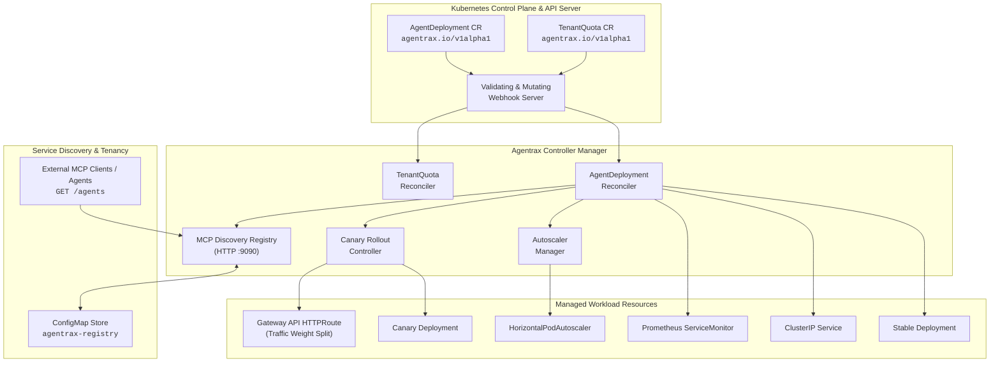

# Agentrax

[](https://github.com/gitcommitankit/agentrax/actions/workflows/ci.yml)
[](https://goreportcard.com/report/github.com/gitcommitankit/agentrax)
[](LICENSE)
[](https://kubernetes.io/)

**Agentrax** is a declarative, cloud-native Kubernetes operator designed for managing the full lifecycle of AI and LLM Agent workloads. It delivers multi-tenant resource quota admission, metrics-driven horizontal pod autoscaling, statistically gated canary progressive rollouts with automated rollback, and native Model Context Protocol (MCP) service discovery.

---

## Architecture Overview


```mermaid
flowchart TB
    subgraph ControlPlane["Kubernetes Control Plane & API Server"]
        AD["AgentDeployment CR<br/><code>agentrax.io/v1alpha1</code>"]
        TQ["TenantQuota CR<br/><code>agentrax.io/v1alpha1</code>"]
        WH["Validating & Mutating<br/>Webhook Server"]
    end

    subgraph Operator["Agentrax Controller Manager"]
        direction TB
        REC["AgentDeployment<br/>Reconciler"]
        TQC["TenantQuota<br/>Reconciler"]
        ROLL["Canary Rollout<br/>Controller"]
        AUTO["Autoscaler<br/>Manager"]
        REG["MCP Discovery Registry<br/>(HTTP :9090)"]
    end

    subgraph ManagedResources["Managed Workload Resources"]
        DEP_STABLE["Stable Deployment"]
        DEP_CANARY["Canary Deployment"]
        SVC["ClusterIP Service"]
        HPA["HorizontalPodAutoscaler"]
        HTTP_ROUTE["Gateway API HTTPRoute<br/>(Traffic Weight Split)"]
        SM["Prometheus ServiceMonitor"]
    end

    subgraph DiscoveryLayer["Service Discovery & Tenancy"]
        CM["ConfigMap Store<br/><code>agentrax-registry</code>"]
        CLIENT["External MCP Clients / Agents<br/><code>GET /agents</code>"]
    end

    AD --> WH
    TQ --> WH
    WH --> REC
    WH --> TQC
    REC --> DEP_STABLE
    REC --> SVC
    REC --> SM
    REC --> AUTO
    AUTO --> HPA
    REC --> ROLL
    ROLL --> DEP_CANARY
    ROLL --> HTTP_ROUTE
    REC --> REG
    REG <--> CM
    CLIENT --> REG
```

---

## Key Features

| Feature                           | Description                                                                                                            | Key Mechanism                                                           |
| --------------------------------- | ---------------------------------------------------------------------------------------------------------------------- | ----------------------------------------------------------------------- |
| **Declarative Agent Lifecycle**   | Complete deployment management, self-healing, status tracking, and graceful teardown.                                  | `AgentDeployment` reconciler + controller runtime finalizers            |
| **Multi-Tenant Quotas**           | Atomic quota admission preventing concurrent over-commit of agent instances, GPU counts, and total replicas.           | In-flight reservations + Validating Webhook + `TenantQuota` reconciler  |
| **Inference Autoscaling**         | Scale-out and scale-in driven by custom agent metrics (`queueDepth`, `gpuUtilization`) with quota ceiling enforcement. | Prometheus Adapter + native `HorizontalPodAutoscaler`                   |
| **Statistical Canary Rollouts**   | Automated progressive traffic shifting with sample-size gating and Prometheus error/latency threshold rollback.        | Gateway API `HTTPRoute` weights + PromQL evaluation                     |
| **Native MCP Discovery**          | In-cluster registry with JSON-RPC 2.0 handshake validation, tool capability aggregation, and TTL heartbeat sweeps.     | In-operator HTTP Server (`:9090`) + ConfigMap persistence + TTL sweeper |
| **Zero-Trust Network Isolation**  | Default-deny packet filtering isolating tenant agent pods, allowing only scraped metrics, CoreDNS, and API server.     | Two-tier `NetworkPolicy` with `agentrax.io/agent: "true"` pod selection |
| **Multi-Cloud Workload Identity** | Keyless cloud IAM integration for Azure AKS (Workload Identity) and AWS EKS (IRSA) without static credentials.         | Projected service account tokens + cloud OIDC federation                |
| **Full-Stack Observability**      | End-to-end OpenTelemetry distributed tracing, structured `slog` JSON logs, custom Prometheus metrics, and alert rules. | OTLP gRPC export + `PrometheusRule` alerts + Grafana dashboard config   |

---

## Getting Started

### Prerequisites

- **Go**: `v1.22+`
- **Docker**: `v20.10+`
- **Kubernetes Cluster**: `v1.28+` (e.g., `kind`, `minikube`, AKS, EKS)
- **kubectl**: `v1.28+`
- **Helm**: `v3.14+`

---

### Installation Options

#### Option 1: 1-Line Release Install (Recommended)

Deploy the latest official release (`v0.2.1`) including all CRDs, RBAC roles, manager deployment, and zero-trust network policies:

```bash
kubectl apply -f https://github.com/gitcommitankit/agentrax/releases/download/v0.2.1/install.yaml
```

#### Option 2: Installation via Helm (Configurable & Production)

Add the official Agentrax Helm repository hosted on GitHub Pages:

```bash
# Add and update the repository
helm repo add agentrax https://gitcommitankit.github.io/agentrax
helm repo update

# Install Agentrax
helm install agentrax agentrax/agentrax \
  --namespace agentrax-system \
  --create-namespace \
  --set prometheus.url="http://kube-prometheus-stack-prometheus.monitoring.svc:9090"
```

For cloud workload identity deployments (Azure AKS or AWS EKS), see [Cloud Workload Identity Guide](docs/cloud/workload-identity.md).

#### Option 3: Automated Local Dev Stack via Terraform

If developing locally on Kind, provision a 2-node cluster with `cert-manager`, `kube-prometheus-stack`, and `agentrax` in strict dependency order with a single command:

```bash
make terraform-apply
```

_(Tear down when finished via `make terraform-destroy`)_

#### Option 4: Build & Deploy from Source (Kustomize)

1. **Clone the repository:**

   ```bash
   git clone https://github.com/gitcommitankit/agentrax.git
   cd agentrax
   ```

2. **Install cluster dependencies** (cert-manager, Prometheus Operator, Gateway API CRDs):

   ```bash
   make deploy-deps
   ```

3. **Install Agentrax CRDs and Controller Manager:**

   ```bash
   make install
   make deploy IMG=ghcr.io/gitcommitankit/agentrax:v0.2.1
   ```

4. **Verify the operator is running:**
   ```bash
   kubectl get pods -n agentrax-system
   ```

---

## Usage Guide & Workload Examples

### 1. Define Tenant Quota

Create a tenant quota in the target tenant namespace:

```yaml
apiVersion: agentrax.io/v1alpha1
kind: TenantQuota
metadata:
  name: team-search
  namespace: tenant-search
spec:
  maxAgents: 5
  maxGPUs: 4
  maxTotalReplicas: 15
  maxReplicasPerAgent: 5
```

```bash
kubectl apply -f config/samples/agentrax_v1alpha1_tenantquota.yaml
```

---

### 2. Deploy an AI Agent with Autoscaling and MCP Discovery

```yaml
apiVersion: agentrax.io/v1alpha1
kind: AgentDeployment
metadata:
  name: search-agent
  namespace: tenant-search
spec:
  image: ghcr.io/my-org/search-agent:v1.0.0
  port: 8080
  tenantRef: team-search
  replicas:
    min: 1
    max: 4
    metric: queueDepth
    target: 25
  rollout:
    strategy: Recreate
  mcp:
    expose: true
    tools:
      - webSearch
      - documentRetriever
```

```bash
kubectl apply -f config/samples/agentrax_v1alpha1_agentdeployment_mcp.yaml
```

---

### 3. Progressive Canary Rollout with Automated Rollback

```yaml
apiVersion: agentrax.io/v1alpha1
kind: AgentDeployment
metadata:
  name: search-agent
  namespace: tenant-search
spec:
  image: ghcr.io/my-org/search-agent:v2.0.0
  tenantRef: team-search
  replicas:
    min: 1
    max: 4
    metric: queueDepth
    target: 25
  rollout:
    strategy: Canary
    steps:
      - setWeight: 20
      - pause: 60s
      - setWeight: 50
      - pause: 120s
      - setWeight: 100
    rollback:
      maxErrorRate: "1%" # Max 1% error rate
      maxP99LatencyMs: 450 # Max 450ms P99 latency
      minRequestSample: 100 # Minimum sample size before evaluating
```

---

## MCP Discovery REST API

The operator manager serves an in-cluster REST discovery API on port `9090` exposed by the `agentrax-registry` Service in `agentrax-system`.

### Query Registered Agents

```bash
# Port-forward to local machine
kubectl port-forward svc/agentrax-registry 9090:9090 -n agentrax-system

# List all active agents
curl -s http://localhost:9090/agents | jq .
```

**Example Response:**

```json
[
  {
    "namespace": "tenant-search",
    "name": "search-agent",
    "endpoint": "http://search-agent.tenant-search.svc:8080",
    "tools": ["webSearch", "documentRetriever", "calculator"],
    "registeredAt": "2026-08-16T10:00:00Z",
    "heartbeatAt": "2026-08-16T10:05:00Z",
    "ttl": 90000000000
  }
]
```

The `ttl` field is expressed in nanoseconds (e.g., `90000000000` = 90 seconds).

### Endpoints

| Method   | Path                         | Description                                                                                                                   |
| -------- | ---------------------------- | ----------------------------------------------------------------------------------------------------------------------------- |
| `GET`    | `/agents`                    | List all active, non-expired registered agents.                                                                               |
| `GET`    | `/agents/{namespace}/{name}` | Get details and discovered tool capabilities of a specific agent.                                                             |
| `POST`   | `/agents`                    | Directly register or update an agent entry (bypasses MCP handshake; for administrative use or testing, not normal operation). |
| `DELETE` | `/agents/{namespace}/{name}` | Deregister an agent from the registry store.                                                                                  |

---

## Configuration Reference

### Command-Line Arguments

| Flag                          | Default            | Description                                                          |
| ----------------------------- | ------------------ | -------------------------------------------------------------------- |
| `--metrics-bind-address`      | `0`                | Metrics HTTP endpoint address (`:8443` or `:8080`, `0` to disable).  |
| `--health-probe-bind-address` | `:8081`            | Address for `/healthz` and `/readyz` probes.                         |
| `--leader-elect`              | `false`            | Enable leader election for active-standby controller HA.             |
| `--registry-bind-address`     | `:9090`            | Address for the embedded MCP discovery HTTP server.                  |
| `--gpu-resource-name`         | `nvidia.com/gpu`   | Resource name used for GPU quota accounting.                         |
| `--prometheus-url`            | `""`               | Prometheus API base URL for canary metric queries.                   |
| `--gateway-name`              | `agentrax-gateway` | Gateway API object name for canary traffic splits.                   |
| `--gateway-namespace`         | `agentrax-system`  | Gateway API object namespace.                                        |
| `--otlp-endpoint`             | `""`               | gRPC endpoint for OpenTelemetry trace exporter (e.g. `jaeger:4317`). |
| `--otlp-insecure`             | `false`            | Use plaintext gRPC for local development tracing.                    |
| `--log-level`                 | `info`             | Minimum structured log level (`debug`, `info`, `warn`, `error`).     |

### Environment Variables

| Variable                       | Default | Description                                                                |
| ------------------------------ | ------- | -------------------------------------------------------------------------- |
| `ENABLE_WEBHOOKS`              | auto    | Auto-enabled when TLS certs exist on disk. Set `false` to force-disable.   |
| `AGENTRAX_MCP_HEALTH_INTERVAL` | `60s`   | Frequency of background MCP health probes (Helm chart overrides to `30s`). |
| `AGENTRAX_REGISTRY_TTL`        | `90s`   | Expiration window for unrefreshed registry entries.                        |
| `POD_NAMESPACE`                | `""`    | Controller namespace (used for the `agentrax-registry` store).             |

---

## Detailed Documentation

- [System Architecture](docs/ARCHITECTURE.md) — Comprehensive technical architecture, reconciliation flows, and ADRs
- [Zero-Trust Network Policies](docs/networking/README.md) — Packet-level firewalling and multi-tenant agent network isolation
- [Cloud Workload Identity Guide](docs/cloud/workload-identity.md) — Keyless authentication on Azure AKS & AWS EKS
- [Observability, Alerting & Tracing Guide](docs/observability/README.md) — Metrics, Prometheus alerting rules, Grafana, and Jaeger
- [Helm Chart Reference](charts/agentrax/README.md) — Values schema, production installation, and parameters
- [Terraform Infrastructure Guide](infra/README.md) — Local Kind cluster provisioning and cloud stack deployment
- [Contributing Guide](CONTRIBUTING.md) — Prerequisites, development setup, and pull request workflow
- [Security Policy](SECURITY.md) — Supported versions and vulnerability reporting

---

## Development & Testing

### Git Commit Barriers

Install traditional `pre-commit` and `pre-push` hooks:

```bash
make setup-git-hooks
```

### Run Tests and Linters

```bash
# Run golangci-lint
make lint

# Run all unit and integration tests (envtest)
make test

# Generate CRD manifests and DeepCopy methods
make manifests generate

# Build local manager binary
make build
```

---

## License

Copyright 2026. Licensed under the [Apache License, Version 2.0](LICENSE).
