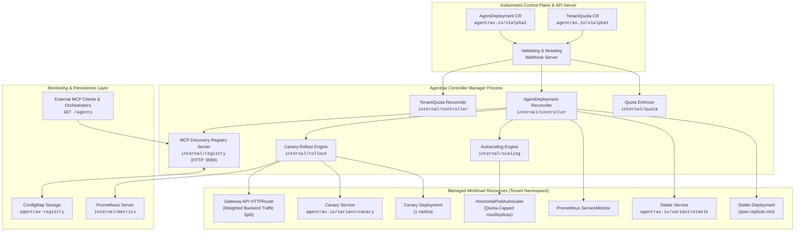
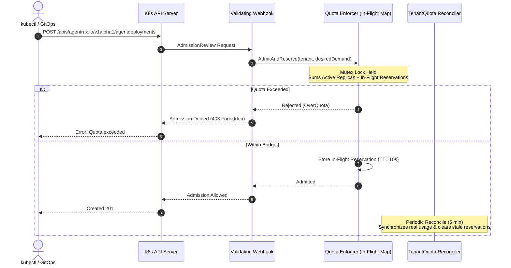
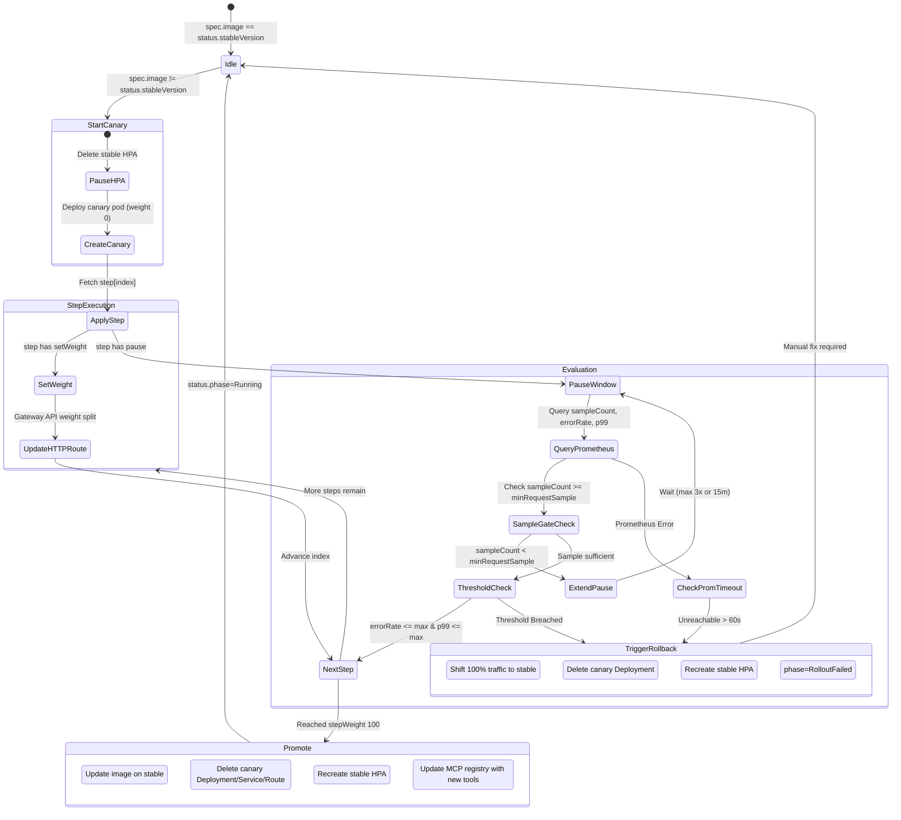

# Agentrax — System Architecture Blueprint & Design Document

> **Status**: Authoritative System Architecture Reference  
> **API Group**: `agentrax.io/v1alpha1`  
> **Maintainers**: Agentrax Engineering & Architecture  
> **Notice**: This document serves as the permanent system design reference and architectural contract for the Agentrax Kubernetes Operator. Any architectural changes, CRD modifications, or invariant updates must be reflected here.

---

## 1. System Overview & Core Philosophy

**Agentrax** is a specialized, cloud-native Kubernetes operator purpose-built to manage the end-to-end lifecycle of AI and Large Language Model (LLM) Agent workloads.

Unlike standard microservices, autonomous agents and LLM inference endpoints possess unique operational profiles:

1. **Asymmetric Resource Footprints**: Agents consume varying ratios of CPU, GPU units, and external tool resources.
2. **Low-Traffic Statistical Vulnerability**: Canaries on internal agent services often handle lower request volumes where standard error-rate percentages produce statistical noise.
3. **Dynamic Tool Capabilities**: AI agents expose dynamic tool sets via the **Model Context Protocol (MCP)** that external clients and multi-agent orchestrators need to discover in real time.

### Core Architectural Principles

- **Re-entrant State Machines**: All rollout and lifecycle workflows persist their operational state in the CRD `status` subresource, ensuring immediate recovery and zero state drift across controller manager restarts.
- **Idempotent Reconciliation**: Every managed child resource is reconciled via `controllerutil.CreateOrUpdate` with isolated `MutateFn` closures, preserving API-server-defaulted fields.
- **Atomic Multi-Tenancy**: Quota admission uses in-flight memory reservations to guarantee atomic concurrency safety and prevent Time-Of-Check to Time-Of-Use (TOCTOU) budget exhaustion.
- **Fail-Safe Self-Healing**: Telemetry or monitoring outages trigger deterministic, fail-safe rollbacks rather than halting or hanging production rollouts.
- **Native Kubernetes Idioms**: Built natively on top of Gateway API (`HTTPRoute`), standard `HorizontalPodAutoscaler` (via Prometheus Adapter), and Kubernetes finalizer foreground garbage collection.

---

## 2. High-Level System Architecture



---

## 3. Package Architecture & Separation of Concerns

The repository enforces strict directional boundaries to prevent circular dependencies and isolate business logic from Kubernetes plumbing:

| Package                      | Scope & Responsibility                                                                          | Key Invariants                                                                                       |
| ---------------------------- | ----------------------------------------------------------------------------------------------- | ---------------------------------------------------------------------------------------------------- |
| `api/v1alpha1/`              | CRD type definitions, OpenAPI markers, schema validation rules, and status condition constants. | **Zero business logic**; only struct declarations and generated deep-copy methods.                   |
| `internal/controller/`       | Controller-runtime reconcile loops (`AgentDeployment`, `TenantQuota`).                          | Only layer that executes write calls against the Kubernetes API for core-owned resources (Deployments, Services, HPAs, HTTPRoutes). Consumes subsystems via interfaces. |
| `internal/quota/`            | Quota arithmetic and concurrency-safe in-flight reservation cache.                              | Pure arithmetic; mutex-guarded state map; zero direct API server network calls in calculation paths. |
| `internal/webhook/`          | Validating and Mutating admission webhooks.                                                     | Shared with `internal/quota` to enforce admission rules before objects are persisted.                |
| `internal/scaling/`          | HPA synthesis, velocity rules, and dynamic quota ceiling headroom.                              | Calculates `QuotaHeadroom()` to cap HPA `maxReplicas` and applies stabilization windows.             |
| `internal/rollout/`          | Canary state machine, PromQL query construction, and threshold evaluation.                      | Re-entrant state machine; sample-size gating; fail-safe timeout evaluation.                          |
| `internal/registry/`         | MCP registrar, JSON-RPC 2.0 handshake, TTL sweeper, and discovery REST API.                     | In-memory registry with ConfigMap write-through for persistence; background health probes and TTL sweep. Explicitly allowed to write the `agentrax-registry` ConfigMap for state recovery. |
| `internal/metrics/`          | Bounded HTTP Prometheus query client.                                                           | Wraps all responses with `io.LimitReader` (1 MiB ceiling) to prevent memory exhaustion.              |

---

## 4. Core Subsystems Deep Dive

### 4.1 Multi-Tenancy & Atomic Quota Admission

Multi-tenancy in Agentrax is enforced at the namespace level via the `TenantQuota` CRD. Each tenant namespace (`tenant-<name>`) contains exactly one `TenantQuota` defining upper bounds on:

- `maxAgents`: Total number of `AgentDeployment` instances permitted.
- `maxGPUs`: Total number of GPU units across all pods in the namespace.
- `maxTotalReplicas`: Maximum sum of pod replicas across all agents in the namespace.
- `maxReplicasPerAgent`: Ceiling on `spec.replicas.max` for any single agent.



#### Key Invariants:

1. **Atomic `AdmitAndReserve`**: Prevents TOCTOU race conditions where two simultaneous creation requests each pass naive read checks but collectively blow the quota ceiling.
2. **Dry-Run Awareness**: Admission webhooks evaluate `AdmissionRequest.DryRun`; dry-run requests never write to the in-flight reservation map.
3. **Non-Destructive Over-Quota Handling**: If an administrator lowers a `TenantQuota` below active usage, the reconciler sets the `OverQuota` condition on the quota object but **never forcibly terminates running workloads**.

---

### 4.2 Metrics-Driven Autoscaling & Dynamic Quota Headroom

Agentrax dynamically synthesizes and manages a `HorizontalPodAutoscaler` (autoscaling/v2) for each `AgentDeployment`.

```
                    ┌────────────────────────┐
                    │     TenantQuota        │
                    │ (maxTotalReplicas: 20) │
                    └───────────┬────────────┘
                                │
        ┌───────────────────────┴───────────────────────┐
        ▼                                               ▼
┌───────────────────────────────┐               ┌───────────────────────────────┐
│        Agent A (Active)       │               │        Agent B (Scaling)      │
│  Current: 8 pods              │               │  spec.replicas: min 2, max 10 │
│  spec.replicas: min 2, max 10 │               │  Used by others: 8            │
└───────────────────────────────┘               │  Total budget remaining: 12   │
                                                │  QuotaHeadroom() -> 10 (Max)  │
                                                └───────────────────────────────┘
```

#### Dynamic Quota Ceiling Math:

Before writing the HPA, the reconciler computes the available headroom:
$$\text{Headroom} = \min(\text{spec.replicas.max}, \, \text{maxReplicasPerAgent}, \, \text{maxTotalReplicas} - \text{ActiveReplicasOtherAgents})$$

If $\text{Headroom} < \text{spec.replicas.min}$, HPA `maxReplicas` is clamped to `spec.replicas.min` and the condition `QuotaLimited: Capped` is surfaced on the `AgentDeployment`.

#### Stabilization Windows & Velocity Control:

To prevent flapping during bursty LLM agent inference loads:

- **Scale-Up**: Stabilization window of `60s`; scale-up rate-limited to **4 pods per 60s** (`autoscalingv2.PodsScalingPolicy`, `Value: 4, PeriodSeconds: 60`).
- **Scale-Down**: Stabilization window of `300s` (5 minutes); scale-down rate-limited to **1 pod per 60s** (`autoscalingv2.PodsScalingPolicy`, `Value: 1, PeriodSeconds: 60`).

---

### 4.3 Progressive Canary Rollout & Statistical Auto-Rollback

When an `AgentDeployment` has `strategy: Canary` and the image changes, Agentrax enters the `RolloutInProgress` state machine:



#### Statistical Sample-Gating Invariant:

Evaluating error percentages over small sample sizes (e.g., 2 errors out of 3 requests = 66% error rate) causes catastrophic false-positive rollbacks on low-traffic agents. Agentrax strictly enforces:

1. **Sample Gate**: Thresholds are **never evaluated** until $\text{ObservedRequests} \ge \text{minRequestSample}$.
2. **Pause Extension**: If the sample size is insufficient when a pause timer expires, the pause is extended in increments up to $\min(3 \times \text{step.pause}, 15\text{ minutes})$.
3. **Canonical Duration Syntax**: PromQL duration selectors are formatted into canonical Prometheus syntax (`5m`, `1h`, `30s`, no trailing `0s`).
4. **Fail-Safe Prometheus Timeout**: If Prometheus is completely unreachable for $>60\text{ seconds}$ (`promUnreachableSince`), Agentrax triggers an automated fail-safe rollback.

---

### 4.4 MCP Service Discovery & Lifecycle Management

Agentrax features an embedded **Model Context Protocol (MCP)** discovery server served on port `:9090` and exposed via the `agentrax-registry` Service in `agentrax-system`.

The `AgentDeploymentReconciler` in `internal/controller` consumes MCP lifecycle operations via the `AgentRegistrar` interface (`Register`, `Deregister`, `Heartbeat`) — enabling clean dependency injection and test isolation via `mockAgentRegistrar`. The canary rollout `Controller` in `internal/rollout` holds a concrete `*registry.Registrar` to trigger re-registration on promotion.

```
┌────────────────────────────────────────────────────────────────────────────┐
│                    Agentrax Operator Manager Process                       │
│                                                                            │
│  ┌─────────────────────────────────┐   ┌────────────────────────────────┐  │
│  │   AgentDeploymentReconciler     │   │      MCP Discovery Registry    │  │
│  │   Registrar: AgentRegistrar     │──▶│         (HTTP :9090)           │  │
│  │   (interface — test injectable) │   │  • GET /agents                 │  │
│  └─────────────────────────────────┘   │  • GET /agents/{ns}/{name}     │  │
│                                        │  • Background TTL Sweeper      │  │
│  ┌─────────────────────────────────┐   └───────────────┬────────────────┘  │
│  │   Canary rollout.Controller     │                   │                   │
│  │   Registrar: *registry.Registrar│                   │ Write-Through     │
│  │   (concrete — post-promotion    │                   ▼                   │
│  │    re-registration)             │   ┌────────────────────────────────┐  │
│  └─────────────────────────────────┘   │ ConfigMap: `agentrax-registry` │  │
│                                        │ (Cold Startup Recovery Target) │  │
│                                        └────────────────────────────────┘  │
└────────────────────────────────────────────────────────────────────────────┘
```

#### Registration Handshake Protocol:

1. When an agent pod becomes `Ready` and `phase=Running`, the reconciler calls `AgentRegistrar.Register()`.
2. The registrar sends an HTTP `POST` containing a JSON-RPC 2.0 `initialize` payload (protocol version `2024-11-05`) to `http://{name}.{namespace}.svc:{port}/initialize`.
3. Discovered tools from `result.capabilities.tools` are merged with `spec.mcp.tools` (deduplicated).
4. The registration is written to the in-memory map and persisted to the `agentrax-registry` ConfigMap with `retry.RetryOnConflict`.

#### Heartbeat, TTL Sweeper & 3-Strike Rule:

- Every active agent record carries a `TTL` (default `90s`) and a `HeartbeatAt` timestamp.
- While the agent remains healthy in `Running` phase, the reconciler calls `AgentRegistrar.Heartbeat()`.
- A background ticker running every `30s` sweeps the registry and purges entries whose heartbeats have lapsed (handling node crashes and ungraceful pod termination).
- If an agent fails 3 consecutive heartbeat probes, it is automatically deregistered with `ErrHeartbeatDeregistered` and `status.registered` is set to `false`.

---

### 4.5 Garbage Collection & Finalizer Ordering

When an `AgentDeployment` is deleted, Kubernetes sets `metadata.deletionTimestamp`. The reconciler executes the following strict sequence:

```
[AgentDeployment Deletion]
          │
          ▼
1. Fetch object & verify DeletionTimestamp != nil
          │
          ▼
2. Invoke AgentRegistrar.Deregister(ctx, ad)  <--- Child Service & Deployment STILL ALIVE
   • Remove entry from memory & ConfigMap
          │
          ▼
3. Remove finalizer: `agentrax.io/mcp-deregister`
          │
          ▼
4. Update object on API Server
          │
          ▼
5. Kubernetes GC cascade deletes child resources (Deployment, Service, HPA, Route)
```

**Invariant**: MCP deregistration MUST complete _before_ the child `Service` is garbage collected, ensuring external clients never encounter dead routing endpoints.

---

## 5. Architectural Decision Records (ADRs) & Trade-Offs

| Decision                                | Alternative Considered                       | Trade-Off & Rationale for Agentrax                                                                                                                                                                                                                                   |
| --------------------------------------- | -------------------------------------------- | -------------------------------------------------------------------------------------------------------------------------------------------------------------------------------------------------------------------------------------------------------------------- |
| **Gateway API (`HTTPRoute`)**           | Istio `VirtualService` / Ingress Annotations | Istio requires a heavy service-mesh control plane and sidecar injection. Ingress annotations lack standardized multi-backend weighted traffic splits. Gateway API provides a lightweight, vendor-neutral standard for traffic shifting.                              |
| **Custom Canary Rollout Engine**        | Argo Rollouts / Flagger                      | Generic rollout tools treat metric anomalies as pure percentages without low-traffic statistical gating (`minRequestSample`). Building an embedded, re-entrant state machine allowed us to guarantee sample-size gating and MCP tool re-registration upon promotion. |
| **Native HPA via Custom Metrics**       | KEDA (`ScaledObject`)                        | KEDA is powerful but adds external CRD dependencies. Generating native Kubernetes `HorizontalPodAutoscaler` objects tied to the Prometheus Adapter custom metrics pipeline minimized dependencies while giving full control over stabilization windows.              |
| **Embedded Registry + ConfigMap Store** | Dedicated etcd / Redis / Database            | Adding a dedicated database for service discovery increases operator operational complexity. The in-operator HTTP server with ConfigMap write-through store provides simple, robust storage for hundreds of agent services with cold-restart recovery.               |
| **Go (`controller-runtime`)**           | Python (`Kopf`)                              | Go provides native compile-time safety, seamless alignment with Kubernetes upstream libraries, and access to `setup-envtest` for isolated in-process integration testing.                                                                                            |

---

## 6. Canonical Integration Validation Contract

The following top-level integration scenarios represent the non-negotiable correctness guarantees validated by the automated test suite:

```mermaid
gantt
    title Canonical Lifecycle Scenarios
    dateFormat  X
    axisFormat %s
    section Self-Healing
    Delete Child Deployment           :active, a1, 0, 5
    Reconciler Recreates Deployment   :crit, a2, 5, 10
    section Quota Collisions
    Concurrent Near-Limit Creates     :active, b1, 0, 2
    In-Flight Map Admits 1, Rejects 2 :crit, b2, 2, 4
    section Canary Rollback
    Inject 500ms Latency Spike        :active, c1, 0, 5
    Threshold Breached Rollback Fire  :crit, c2, 5, 10
    Traffic Restored 100% Stable      :c3, 10, 12
    section MCP Expiration
    Ungraceful Pod Termination        :active, d1, 0, 10
    TTL Sweeper Purges Expired Entry  :crit, d2, 10, 15
```



1. **Self-Healing Invariant**: Out-of-band manual deletion of any child resource (Deployment, Service, HPA, HTTPRoute) is detected and recreated on the next reconcile cycle with owned state intact.
2. **Quota Barrier Invariant**: Under high-concurrency requests, total admitted replicas and GPU allocations across tenants never exceed the configured `TenantQuota`.
3. **Canary Safety Invariant**: Injected error rates or latency anomalies trigger automated rollback before traffic promotion reaches 100%, and stable traffic is never dropped.
4. **Ungraceful Termination Invariant**: Dead or crashed agent pods that bypass the deletion finalizer are swept from the MCP discovery registry within one TTL cycle ($90\text{s}$).
5. **Foreground Finalizer Invariant**: Deleting an `AgentDeployment` always removes the agent from external discovery _before_ tearing down cluster networking.
