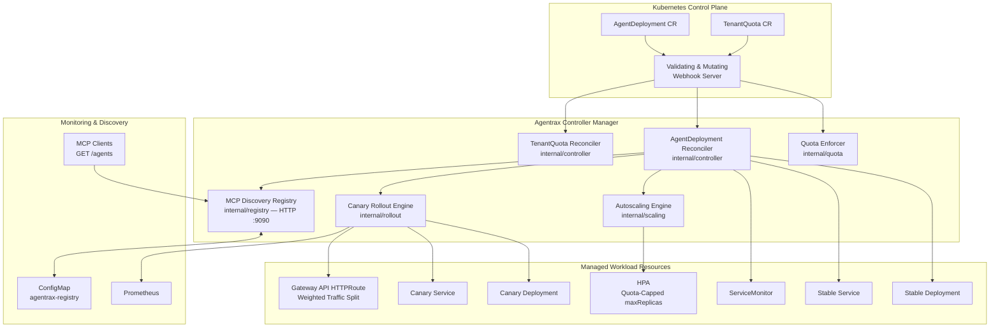
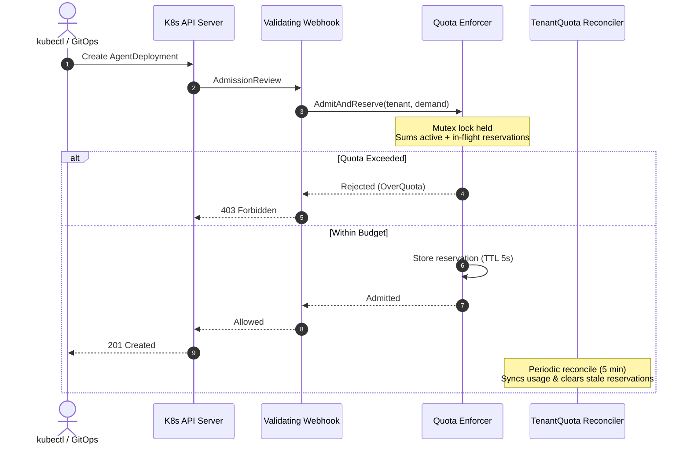
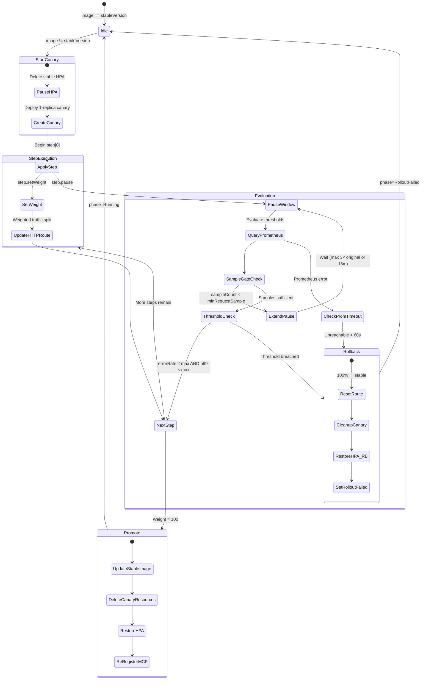

# Agentrax — System Architecture Document

> **Status**: Authoritative Reference — reflects the current implementation  
> **API Group**: `agentrax.io/v1alpha1`  
> **Module**: `github.com/gitcommitankit/agentrax`  
> **Go**: 1.23 · **Runtime**: distroless/static:nonroot  
> **Notice**: Any architectural changes, CRD modifications, or invariant updates must be reflected here.

---

## Table of Contents

1. [System Overview](#1-system-overview)
2. [High-Level Architecture](#2-high-level-architecture)
3. [Repository Layout](#3-repository-layout)
4. [Custom Resource Definitions](#4-custom-resource-definitions)
5. [Package Architecture](#5-package-architecture)
6. [Core Subsystems](#6-core-subsystems)
   - 6.1 [AgentDeployment Reconciler](#61-agentdeployment-reconciler)
   - 6.2 [Multi-Tenancy & Quota Admission](#62-multi-tenancy--quota-admission)
   - 6.3 [Metrics-Driven Autoscaling](#63-metrics-driven-autoscaling)
   - 6.4 [Canary Rollout Engine](#64-canary-rollout-engine)
   - 6.5 [MCP Service Discovery](#65-mcp-service-discovery)
   - 6.6 [Garbage Collection & Finalizer Ordering](#66-garbage-collection--finalizer-ordering)
7. [Observability](#7-observability)
   - 7.1 [Structured Logging](#71-structured-logging)
   - 7.2 [Distributed Tracing](#72-distributed-tracing)
   - 7.3 [Custom Prometheus Metrics](#73-custom-prometheus-metrics)
   - 7.4 [Alerting Rules](#74-alerting-rules)
   - 7.5 [Grafana Dashboard](#75-grafana-dashboard)
8. [Security & Network Isolation](#8-security--network-isolation)
   - 8.1 [Zero-Trust Network Policies](#81-zero-trust-network-policies)
   - 8.2 [Workload Identity](#82-workload-identity)
9. [Deployment & Packaging](#9-deployment--packaging)
   - 9.1 [Helm Chart](#91-helm-chart)
   - 9.2 [Kustomize Overlays](#92-kustomize-overlays)
   - 9.3 [Container Image](#93-container-image)
10. [Infrastructure as Code](#10-infrastructure-as-code)
11. [CI/CD Pipelines](#11-cicd-pipelines)
12. [Testing Strategy](#12-testing-strategy)
13. [Architectural Decision Records](#13-architectural-decision-records)
14. [Canonical Integration Contracts](#14-canonical-integration-contracts)

---

## 1. System Overview

**Agentrax** is a Kubernetes operator purpose-built to manage the full lifecycle of AI agent and LLM inference workloads. It addresses three problems unique to autonomous agent deployments:

1. **Asymmetric Resource Footprints** — Agents consume varying ratios of CPU, GPU, and external tool resources that generic quota systems cannot model.
2. **Low-Traffic Statistical Vulnerability** — Canary deployments on internal agent services handle low request volumes where naive error-rate percentages produce false-positive rollbacks.
3. **Dynamic Tool Capabilities** — AI agents expose tool sets via the Model Context Protocol (MCP) that external clients and multi-agent orchestrators need to discover in real time.

### Core Design Principles

| Principle                     | How it manifests                                                                                                                                                                                        |
| :---------------------------- | :------------------------------------------------------------------------------------------------------------------------------------------------------------------------------------------------------ |
| **Re-entrant State Machines** | The canary rollout persists `canaryStepIndex`, `pauseStartedAt`, and `promUnreachableSince` in the CRD status subresource. Controller restarts resume exactly where they left off.                      |
| **Idempotent Reconciliation** | Every child resource (Deployment, Service, HPA, HTTPRoute, ServiceMonitor) is reconciled via `controllerutil.CreateOrUpdate` with an isolated `MutateFn` closure.                                       |
| **Atomic Multi-Tenancy**      | The validating webhook uses mutex-guarded in-flight reservations to prevent TOCTOU races on quota boundaries.                                                                                           |
| **Fail-Safe Self-Healing**    | Prometheus outages trigger deterministic rollbacks (60s timeout) rather than halting production rollouts. Out-of-band deletion of child resources is detected and repaired on the next reconcile cycle. |
| **Native Kubernetes Idioms**  | Gateway API `HTTPRoute` for traffic splitting, native `HorizontalPodAutoscaler` via Prometheus Adapter, finalizer-based foreground garbage collection.                                                  |

---

## 2. High-Level Architecture


```mermaid
flowchart TB
    subgraph ControlPlane["Kubernetes Control Plane"]
        AD["AgentDeployment CR"]
        TQ["TenantQuota CR"]
        WH["Validating & Mutating<br/>Webhook Server"]
    end

    subgraph Operator["Agentrax Controller Manager"]
        direction TB
        REC["AgentDeployment Reconciler<br/>internal/controller"]
        TQC["TenantQuota Reconciler<br/>internal/controller"]
        ROLL["Canary Rollout Engine<br/>internal/rollout"]
        AUTO["Autoscaling Engine<br/>internal/scaling"]
        QUOTA["Quota Enforcer<br/>internal/quota"]
        REG["MCP Discovery Registry<br/>internal/registry — HTTP :9090"]
    end

    subgraph Managed["Managed Workload Resources"]
        DEP_S["Stable Deployment"]
        DEP_C["Canary Deployment"]
        SVC_S["Stable Service"]
        SVC_C["Canary Service"]
        HPA["HPA<br/>Quota-Capped maxReplicas"]
        HR["Gateway API HTTPRoute<br/>Weighted Traffic Split"]
        SM["ServiceMonitor"]
    end

    subgraph External["Monitoring & Discovery"]
        PROM["Prometheus"]
        CM["ConfigMap<br/>agentrax-registry"]
        CLIENT["MCP Clients<br/>GET /agents"]
    end

    AD --> WH
    TQ --> WH
    WH --> QUOTA
    WH --> REC
    WH --> TQC
    REC --> DEP_S & SVC_S & SM
    REC --> AUTO --> HPA
    REC --> ROLL
    ROLL --> DEP_C & SVC_C & HR
    ROLL --> PROM
    REC --> REG
    REG <--> CM
    CLIENT --> REG
```

### Process Topology

The controller manager runs as a single binary (`cmd/main.go`) hosting:

- **Two reconcile loops**: `AgentDeploymentReconciler` (leader-elected) and `TenantQuotaReconciler` (leader-elected).
- **One validating+mutating admission webhook** server (conditionally enabled via `ENABLE_WEBHOOKS` env or TLS cert presence).
- **One MCP registry HTTP server** on `:9090` (runs on **all replicas** — `NeedLeaderElection() = false`).
- **Shared singletons**: `quota.Enforcer` (shared between webhook and TenantQuota reconciler), `registry.Registry` + `registry.Registrar`.

---

## 3. Repository Layout

```
agentrax/
├── api/v1alpha1/                  # CRD type definitions, deepcopy, constants
│   ├── agentdeployment_types.go   # AgentDeployment spec/status/constants
│   ├── tenantquota_types.go       # TenantQuota spec/status/constants
│   ├── error_rate.go              # ParseErrorRate("2%") → 0.02 helper
│   └── groupversion_info.go       # Group: agentrax.io, Version: v1alpha1
├── cmd/main.go                    # Entrypoint — wires all subsystems
├── internal/
│   ├── controller/                # Reconcile loops + watch handlers
│   │   ├── agentdeployment_controller.go  # 961 lines — full lifecycle
│   │   ├── tenantquota_controller.go      # Usage accounting + OverQuota
│   │   ├── conditions.go                  # SetCondition/GetCondition wrappers
│   │   ├── crd_check.go                   # ServiceMonitor CRD detection
│   │   └── enqueue_handlers.go            # Cross-resource watch mappers
│   ├── rollout/                   # Canary state machine
│   │   ├── canary.go              # 799 lines — Step()/Rollback()/promote
│   │   └── promql.go              # PromQL query builders + duration formatting
│   ├── quota/                     # Quota arithmetic + in-flight reservations
│   │   └── enforcer.go            # AdmitAndReserve/Release/ComputeUsage
│   ├── scaling/                   # HPA synthesis
│   │   └── autoscaler.go          # BuildHPA() + QuotaHeadroom()
│   ├── webhook/                   # Admission webhooks (in internal/ to import quota)
│   │   └── agentdeployment_webhook.go  # Mutating defaults + validating rules
│   ├── registry/                  # MCP service discovery
│   │   ├── registry.go            # Registry store, TTL sweeper, HTTP REST API
│   │   ├── mcp_registrar.go       # Register/Deregister/Heartbeat orchestrator
│   │   └── mcp_client.go          # JSON-RPC 2.0 MCP initialize handshake
│   ├── metrics/                   # Prometheus query client
│   │   └── prometheus.go          # HTTP client with 1 MiB response limit
│   └── observability/             # Cross-cutting observability
│       ├── logging.go             # slog JSON + logr bridge + trace_id injection
│       ├── tracing.go             # OTel TracerProvider + OTLP gRPC exporter
│       └── metrics.go             # Custom Prometheus histogram + gauge
├── config/                        # Kustomize manifests
│   ├── crd/                       # Generated CRD YAMLs
│   ├── rbac/                      # ClusterRole, RoleBinding
│   ├── webhook/                   # Webhook configuration
│   ├── manager/                   # Manager Deployment patch
│   ├── default/                   # Kustomization entry point
│   ├── network-policy/            # NetworkPolicy manifests
│   ├── prometheus/                # ServiceMonitor + PrometheusRule alerts
│   ├── prometheus-adapter/        # Custom metrics adapter config
│   ├── grafana/                   # Dashboard ConfigMap
│   ├── workload-identity/         # IRSA ServiceAccount overlay
│   └── samples/                   # Example CR manifests
├── charts/agentrax/               # Production Helm chart
│   ├── Chart.yaml
│   ├── values.yaml
│   ├── crds/                      # Packaged CRDs
│   └── templates/                 # 9 templates + test hook
├── infra/                         # Terraform IaC
│   ├── modules/
│   │   ├── kind_cluster/          # Local kind cluster via tehcyx/kind
│   │   └── agentrax_stack/        # cert-manager → kube-prometheus → agentrax
│   ├── environments/
│   │   ├── dev/                   # Local development environment
│   │   └── prod/                  # Production stub (Azure AKS)
│   └── .tflint.hcl                # Linting rules
├── test/
│   ├── e2e/                       # End-to-end tests (envtest + Ginkgo)
│   └── utils/                     # Test utility helpers
├── hack/
│   ├── boilerplate.go.txt         # License header template
│   └── setup-git-hooks.sh         # Developer git hook setup
├── .github/
│   ├── workflows/                 # 5 CI/CD workflows
│   └── ISSUE_TEMPLATE/            # Bug/feature templates
├── Dockerfile                     # Multi-stage distroless build
├── Makefile                       # Developer workflow targets
├── README.md                      # User-facing documentation
├── CONTRIBUTING.md                # Contribution guidelines
└── SECURITY.md                    # Security policy
```

---

## 4. Custom Resource Definitions

### 4.1 AgentDeployment

**API**: `agentdeployments.agentrax.io/v1alpha1`  
**Scope**: Namespaced  
**File**: `api/v1alpha1/agentdeployment_types.go`

```yaml
apiVersion: agentrax.io/v1alpha1
kind: AgentDeployment
metadata:
  name: my-agent
  namespace: tenant-alpha
spec:
  image: ghcr.io/org/my-agent:v2.1
  port: 8080 # default: 8080
  tenantRef: alpha-quota # references TenantQuota in same namespace
  replicas:
    min: 2
    max: 10
    metric: queueDepth # or gpuUtilization
    target: 5
  rollout:
    strategy: Canary # or Recreate (default)
    abort: false # set true to trigger immediate rollback
    steps:
      - setWeight: 20
      - pause: { duration: 2m }
      - setWeight: 50
      - pause: { duration: 5m }
      - setWeight: 100
    rollback:
      maxErrorRate: "2%"
      maxP99LatencyMs: 500
      minRequestSample: 50
  mcp:
    expose: true
    tools: [search, summarize]
  resources:
    limits:
      nvidia.com/gpu: "1"
      memory: 4Gi
  env:
    - name: MODEL_NAME
      value: gpt-4
  args: ["--serve"]
```

#### Status Subresource

| Field                  | Type                                                           | Purpose                                              |
| :--------------------- | :------------------------------------------------------------- | :--------------------------------------------------- |
| `phase`                | `Pending\|Running\|RolloutInProgress\|RolloutFailed\|Degraded` | High-level lifecycle state                           |
| `currentReplicas`      | `int32`                                                        | Running replica count                                |
| `stableVersion`        | `string`                                                       | Image of the stable Deployment                       |
| `canaryVersion`        | `string`                                                       | Image of the canary Deployment (if active)           |
| `canaryWeight`         | `int32`                                                        | Current traffic percentage to canary (0–100)         |
| `canaryStepIndex`      | `int`                                                          | Persisted rollout step index for restart recovery    |
| `pauseStartedAt`       | `*metav1.Time`                                                 | When the current pause step began                    |
| `promUnreachableSince` | `*metav1.Time`                                                 | When Prometheus became unreachable (fail-safe timer) |
| `registered`           | `bool`                                                         | Whether the agent is in the MCP registry             |
| `conditions`           | `[]metav1.Condition`                                           | Standard Kubernetes conditions                       |

#### kubectl Print Columns

`Phase` · `Replicas` · `Stable` · `Registered` · `Age`

#### Condition Types

| Constant                      | Condition Type       | Meaning                                |
| :---------------------------- | :------------------- | :------------------------------------- |
| `ConditionReady`              | `Ready`              | All resources reconciled and healthy   |
| `ConditionReconciled`         | `Reconciled`         | Latest generation has been processed   |
| `ConditionImagePullFailed`    | `ImagePullFailed`    | Container image pull failure detected  |
| `ConditionQuotaLimited`       | `QuotaLimited`       | HPA maxReplicas capped by tenant quota |
| `ConditionMCPHandshakeFailed` | `MCPHandshakeFailed` | MCP initialize handshake failed        |
| `ConditionSampleInsufficient` | `SampleInsufficient` | Canary metrics below minRequestSample  |

#### Finalizer

`agentrax.io/mcp-deregister` — ensures MCP registry deregistration completes before Kubernetes garbage-collects child resources.

---

### 4.2 TenantQuota

**API**: `tenantquotas.agentrax.io/v1alpha1`  
**Scope**: Namespaced  
**File**: `api/v1alpha1/tenantquota_types.go`

```yaml
apiVersion: agentrax.io/v1alpha1
kind: TenantQuota
metadata:
  name: alpha-quota
  namespace: tenant-alpha
spec:
  maxAgents: 5
  maxGPUs: 8
  maxTotalReplicas: 20
  maxReplicasPerAgent: 10
```

#### Spec Fields

| Field                 | Description                                                                                       |
| :-------------------- | :------------------------------------------------------------------------------------------------ |
| `maxAgents`           | Maximum number of AgentDeployment objects allowed                                                 |
| `maxGPUs`             | Total GPU units across all pods (`spec.resources.limits["nvidia.com/gpu"]` × `spec.replicas.max`) |
| `maxTotalReplicas`    | Sum ceiling of `spec.replicas.max` across all agents                                              |
| `maxReplicasPerAgent` | Per-agent cap on `spec.replicas.max`                                                              |

#### Status Fields

`usedAgents` · `usedGPUs` · `usedTotalReplicas` · `conditions` (includes `OverQuota`)

#### kubectl Print Columns

`MaxAgents` · `UsedAgents` · `MaxGPUs` · `UsedGPUs` · `Age`

---

## 5. Package Architecture

The codebase enforces strict directional import boundaries to prevent circular dependencies:

```
api/v1alpha1  ←  internal/quota  ←  internal/webhook
                        ↑                    ↑
              internal/controller ───────────┘
                   ↓    ↓    ↓
            internal/  internal/  internal/
            rollout    scaling    registry
                ↓
           internal/metrics

           internal/observability (consumed by controller, main)
```

| Package                   | Responsibility                                                                                                           | Key Invariant                                                                                |
| :------------------------ | :----------------------------------------------------------------------------------------------------------------------- | :------------------------------------------------------------------------------------------- |
| `api/v1alpha1/`           | CRD structs, OpenAPI markers, deepcopy, condition constants.                                                             | Zero business logic.                                                                         |
| `internal/controller/`    | Reconcile loops for `AgentDeployment` and `TenantQuota`. Only layer performing Kubernetes API writes for core resources. | Consumes subsystems via interfaces (`AgentRegistrar`).                                       |
| `internal/quota/`         | Quota arithmetic, in-flight reservation map, background sweep.                                                           | Mutex-guarded; zero direct API server calls in calculation paths.                            |
| `internal/webhook/`       | Validating + mutating admission webhooks.                                                                                | Lives in `internal/` (not `api/`) to import `internal/quota` without creating import cycles. |
| `internal/scaling/`       | HPA synthesis, `BuildHPA()`, `QuotaHeadroom()` capping.                                                                  | Pure functions — no API calls. Caller handles `CreateOrUpdate`.                              |
| `internal/rollout/`       | Canary state machine (`Step`/`Rollback`), PromQL builder, threshold evaluation.                                          | Re-entrant; persists state to CRD status.                                                    |
| `internal/registry/`      | MCP registry (in-memory + ConfigMap persistence), HTTP REST API, JSON-RPC 2.0 handshake client.                          | Allowed to write the `agentrax-registry` ConfigMap. Background TTL sweeper.                  |
| `internal/metrics/`       | Bounded Prometheus HTTP query client.                                                                                    | All responses wrapped with `io.LimitReader` (1 MiB ceiling).                                 |
| `internal/observability/` | Structured logging, OTel tracing, custom Prometheus metrics.                                                             | Package-level `Tracer` always safe to call (no-op when tracing disabled).                    |

---

## 6. Core Subsystems

### 6.1 AgentDeployment Reconciler

**File**: `internal/controller/agentdeployment_controller.go` (961 lines)

The reconciler manages the complete lifecycle of an AI agent workload. Each reconcile cycle follows this sequence:

```
1. Fetch AgentDeployment (not found → return, it was deleted)
2. Handle deletion (finalizer logic — see §6.6)
3. Add finalizer if absent
4. Reconcile stable Deployment (CreateOrUpdate, owner ref)
5. Reconcile stable Service (CreateOrUpdate, owner ref)
6. Reconcile ServiceMonitor (conditional — only if CRD exists)
7. Handle canary rollout (delegate to rollout.Controller if active)
8. Reconcile HPA (delegate to scaling.BuildHPA, quota-capped)
9. Handle MCP registration/heartbeat
10. Update status (phase, replicas, conditions) — always last
```

**Key implementation details:**

- **OTel tracing**: Every reconcile creates a span `agentdeployment.reconcile` with `namespace` and `name` attributes. Errors are recorded on the span.
- **Metrics instrumentation**: A deferred closure at the top of `Reconcile()` records `agentrax_reconcile_duration_seconds` on every exit path.
- **ServiceMonitor detection**: `hasServiceMonitorCRD` is probed once during `SetupWithManager` via `serviceMonitorCRDExists()` checking for the `servicemonitors.monitoring.coreos.com` CRD. When absent, ServiceMonitor reconciliation is skipped silently.
- **Quota state tracking**: Uses a `quotaState` enum (`Uncapped`, `Capped`, `Unknown`, `Skipped`) to precisely control `QuotaLimited` condition management — ensuring canary rollouts don't erroneously clear pre-existing quota conditions.
- **Self-healing**: Out-of-band deletion of any child resource (Deployment, Service, HPA, HTTPRoute, ServiceMonitor) is detected and recreated on the next reconcile because `CreateOrUpdate` is called unconditionally.

**Watch Setup** (`SetupWithManager`):

- Owns: `Deployment`, `Service`, `HPA`, `HTTPRoute`
- Watches: `TenantQuota` → enqueues all referencing `AgentDeployment` objects (via `enqueueAgentDeploymentsForTenantQuota`)

---

### 6.2 Multi-Tenancy & Quota Admission

Multi-tenancy is enforced at the namespace level. Each tenant namespace contains exactly one `TenantQuota` defining resource ceilings.


```mermaid
sequenceDiagram
    autonumber
    actor User as kubectl / GitOps
    participant APIServer as K8s API Server
    participant Webhook as Validating Webhook
    participant Enforcer as Quota Enforcer
    participant Reconciler as TenantQuota Reconciler

    User->>APIServer: Create AgentDeployment
    APIServer->>Webhook: AdmissionReview
    Webhook->>Enforcer: AdmitAndReserve(tenant, demand)
    Note over Enforcer: Mutex lock held<br/>Sums active + in-flight reservations
    alt Quota Exceeded
        Enforcer-->>Webhook: Rejected (OverQuota)
        Webhook-->>APIServer: 403 Forbidden
    else Within Budget
        Enforcer->>Enforcer: Store reservation (TTL 5s)
        Enforcer-->>Webhook: Admitted
        Webhook-->>APIServer: Allowed
        APIServer-->>User: 201 Created
        Note over Reconciler: Periodic reconcile (5 min)<br/>Syncs usage & clears stale reservations
    end
```

#### Quota Enforcer (`internal/quota/enforcer.go`, 418 lines)

- **`AdmitAndReserve`**: Atomic check-and-reserve under mutex. Computes `usedAgents + inFlightAgents` against `maxAgents`, etc.
- **`Release`**: Called by `TenantQuotaReconciler` once the AD is committed to etcd — clears the in-flight reservation early.
- **`ComputeUsage`**: Pure arithmetic over a slice of `AgentDeploymentSpec` values. GPU count derived from `spec.resources.limits["nvidia.com/gpu"]` × `spec.replicas.max`.
- **Background sweep**: A goroutine ticks every 1s and purges expired reservation entries (5s TTL).
- **`IsOverQuota`**: Returns whether current usage exceeds any spec ceiling — used by the TenantQuota reconciler to set/clear the `OverQuota` condition.
- **GPU resource name**: Configurable via `--gpu-resource-name` flag (default: `nvidia.com/gpu`).

#### Webhook (`internal/webhook/agentdeployment_webhook.go`, 379 lines)

- **Mutating defaults**: Sets `spec.port` default (8080), `spec.rollout.strategy` default (Recreate).
- **Validating rules**: `min ≤ max`, valid metric enum (`queueDepth`/`gpuUtilization`), error rate format (`"2%"`), canary steps require rollback thresholds, `minRequestSample ≥ 1`.
- **Quota enforcement**: On CREATE, calls `AdmitAndReserve`. On UPDATE, computes the delta and reserves only the increase. On DELETE, releases.
- **Dry-run awareness**: `DryRun=true` requests never write to the in-flight map.
- **Non-destructive over-quota**: If `maxTotalReplicas` is lowered below active usage, the TenantQuota reconciler sets `OverQuota` condition but **never deletes running workloads**.

#### TenantQuota Reconciler (`internal/controller/tenantquota_controller.go`, 166 lines)

- Lists all `AgentDeployment` objects in the namespace referencing this quota via `spec.tenantRef`.
- Calls `Enforcer.Release()` for each committed AD to clear any lingering in-flight reservations.
- Calls `Enforcer.ComputeUsage()` to calculate real usage.
- Updates `status.usedAgents`, `status.usedGPUs`, `status.usedTotalReplicas`.
- Sets/clears `OverQuota` condition via `meta.SetStatusCondition`.
- Emits the `agentrax_tenant_quota_usage_ratio` gauge metric.
- Requeues every **5 minutes** as a safety net for missed watch events.
- Watches `AgentDeployment` objects to trigger recomputation when agents change.

---

### 6.3 Metrics-Driven Autoscaling

**File**: `internal/scaling/autoscaler.go` (213 lines)

Agentrax synthesizes a native `HorizontalPodAutoscaler` (autoscaling/v2) for each AgentDeployment, wired to custom metrics exposed through the Prometheus Adapter.

#### Custom Metrics

| `spec.replicas.metric` | Prometheus Adapter Metric Name | Type     |
| :--------------------- | :----------------------------- | :------- |
| `queueDepth`           | `agentrax_queue_depth`         | External |
| `gpuUtilization`       | `agentrax_gpu_utilization`     | External |

#### Dynamic Quota Ceiling

Before writing the HPA, the reconciler computes available headroom:

$$\text{maxReplicas} = \min(\text{spec.replicas.max},\; \text{maxReplicasPerAgent},\; \text{maxTotalReplicas} - \text{activeReplicasOtherAgents})$$

If $\text{maxReplicas} < \text{spec.replicas.min}$, the HPA is clamped to `spec.replicas.min` and the `QuotaLimited` condition is set with reason `HPAMaxReplicasCapped`.

#### Stabilization Windows

| Direction  | Stabilization | Rate Limit     |
| :--------- | :------------ | :------------- |
| Scale-up   | 60s           | 4 pods per 60s |
| Scale-down | 300s (5 min)  | 1 pod per 60s  |

#### HPA Lifecycle During Canary

When a canary rollout begins, the reconciler **deletes the stable HPA** to prevent autoscaling interference with the 1-replica canary. After promotion or rollback, the HPA is recreated.

#### Prometheus Adapter Configuration

The `config/prometheus-adapter/custom-metrics-config.yaml` defines the translation rules that map Prometheus metrics to the Kubernetes custom metrics API consumed by HPA.

---

### 6.4 Canary Rollout Engine

**File**: `internal/rollout/canary.go` (799 lines) + `internal/rollout/promql.go` (243 lines)

When `spec.rollout.strategy = Canary` and the image changes, the reconciler delegates to `rollout.Controller.Step()`:


```mermaid
stateDiagram-v2
    [*] --> Idle: image == stableVersion
    Idle --> StartCanary: image != stableVersion

    state StartCanary {
        [*] --> PauseHPA: Delete stable HPA
        PauseHPA --> CreateCanary: Deploy 1-replica canary
        CreateCanary --> ApplyStep: Begin step[0]
    }

    state StepExecution {
        ApplyStep --> SetWeight: step.setWeight
        SetWeight --> UpdateHTTPRoute: Weighted traffic split
        UpdateHTTPRoute --> NextStep

        ApplyStep --> PauseWindow: step.pause
        PauseWindow --> QueryPrometheus: Evaluate thresholds
    }

    state Evaluation {
        QueryPrometheus --> SampleGateCheck
        SampleGateCheck --> ExtendPause: sampleCount < minRequestSample
        ExtendPause --> PauseWindow: Wait (max 3× original or 15m)

        SampleGateCheck --> ThresholdCheck: Samples sufficient
        ThresholdCheck --> NextStep: errorRate ≤ max AND p99 ≤ max
        ThresholdCheck --> Rollback: Threshold breached

        QueryPrometheus --> CheckPromTimeout: Prometheus error
        CheckPromTimeout --> Rollback: Unreachable > 60s
    }

    NextStep --> StepExecution: More steps remain
    NextStep --> Promote: Weight = 100

    state Promote {
        [*] --> UpdateStableImage
        UpdateStableImage --> DeleteCanaryResources
        DeleteCanaryResources --> RestoreHPA
        RestoreHPA --> ReRegisterMCP
    }

    state Rollback {
        [*] --> ResetRoute: 100% → stable
        ResetRoute --> CleanupCanary
        CleanupCanary --> RestoreHPA_RB
        RestoreHPA_RB --> SetRolloutFailed
    }

    Promote --> Idle: phase=Running
    Rollback --> Idle: phase=RolloutFailed
```

#### Key Behaviors

- **Abort field**: Setting `spec.rollout.abort = true` triggers `Rollback()` immediately.
- **Self-healing canary resources**: On every `Step()` call, the controller verifies the canary Deployment, Service, and HTTPRoute exist and match the desired state. Drift or out-of-band deletion is repaired.
- **Sample-size gating**: Thresholds are **never evaluated** until `observedRequests ≥ minRequestSample`. If insufficient at pause expiry, the pause extends in increments up to `min(3 × step.pause, 15 minutes)`.
- **Fail-safe timeout**: If Prometheus is unreachable for >60s (`FailSafeTimeout`), an automatic rollback fires. The `promUnreachableSince` timestamp is tracked in CRD status.
- **Canonical PromQL durations**: Durations are formatted into Prometheus syntax (`5m`, `1h`, `30s`) — never producing trailing `0s`.

#### PromQL Queries (auto-generated)

| Metric        | Query Pattern                                                                                       |
| :------------ | :-------------------------------------------------------------------------------------------------- |
| Request count | `sum(increase(http_requests_total{namespace=…,agentrax_io_variant="canary"}[window])) or vector(0)` |
| Error rate    | `(5xx increase / total increase) or vector(0)` — safe division                                      |
| P99 latency   | `histogram_quantile(0.99, sum(rate(http_request_duration_seconds_bucket{…}[window])) by (le))`      |

#### Promotion Sequence

1. Update stable Deployment image to canary version
2. Delete canary Deployment, Service, and HTTPRoute
3. Recreate stable HPA
4. Re-register with MCP registry (discovers potentially new tools)
5. Set `phase=Running`, clear `canaryVersion`

---

### 6.5 MCP Service Discovery

**Files**: `internal/registry/registry.go` (438 lines) + `internal/registry/mcp_registrar.go` (175 lines) + `internal/registry/mcp_client.go` (190 lines)

Agentrax embeds an MCP discovery server that allows external clients and multi-agent orchestrators to discover available AI agents and their tool capabilities.

#### Architecture

```
┌──────────────────────────────────────────────────────────────────────┐
│                  Agentrax Controller Manager                         │
│                                                                      │
│  ┌──────────────────────────┐   ┌─────────────────────────────────┐  │
│  │ AgentDeployment Reconciler│   │    MCP Discovery Registry      │  │
│  │ Registrar: AgentRegistrar│──▶│      (HTTP :9090)               │  │
│  │ (interface — injectable) │   │  GET  /agents                   │  │
│  └──────────────────────────┘   │  POST /agents                   │  │
│                                 │  GET  /agents/{ns}/{name}       │  │
│  ┌──────────────────────────┐   │  DELETE /agents/{ns}/{name}     │  │
│  │ Canary rollout.Controller│   │  Background TTL Sweeper (30s)   │  │
│  │ Registrar: *Registrar    │   └──────────────┬──────────────────┘  │
│  │ (concrete — post-promote │                  │ Write-Through       │
│  │  re-registration)        │                  ▼                     │
│  └──────────────────────────┘   ┌─────────────────────────────────┐  │
│                                 │ ConfigMap: agentrax-registry    │  │
│                                 │ (Cold Startup Recovery)         │  │
│                                 └─────────────────────────────────┘  │
└──────────────────────────────────────────────────────────────────────┘
```

#### Registration Handshake

1. When an agent reaches `phase=Running` with `spec.mcp.expose=true`, the reconciler calls `Registrar.Register()`.
2. The registrar sends an HTTP POST with a JSON-RPC 2.0 `initialize` payload (protocol version `2024-11-05`) to `http://{name}.{namespace}.svc:{port}/initialize`.
3. Discovered tools from `result.capabilities.tools.available` (or `result.tools[]`) are merged with `spec.mcp.tools` (deduplicated).
4. The entry is written to the in-memory map and persisted to the `agentrax-registry` ConfigMap with `retry.RetryOnConflict`.

#### Heartbeat & 3-Strike Deregistration

- Every active agent is heartbeated on each reconcile cycle (interval controlled by `MCPHealthInterval`, default 60s, must be < registry TTL).
- A background TTL sweeper runs every 30s and purges entries whose `HeartbeatAt` exceeds their TTL (default 90s).
- If an agent fails **3 consecutive** heartbeat probes, it is automatically deregistered via `ErrHeartbeatDeregistered` and `status.registered` is set to `false`.
- If a heartbeat succeeds but the agent is not in the registry (e.g., after a cold restart), automatic re-registration is triggered.

#### ConfigMap Persistence

- On `Start()`, the registry loads existing state from the `agentrax-registry` ConfigMap for cold-restart recovery.
- Writes happen on `Register` and `Deregister` operations, and after sweeps that remove entries.
- Heartbeats only update in-memory timestamps (no ConfigMap writes) to avoid excessive write load.

#### Registry TTL Configuration

- Default: 90s (via `registry.DefaultTTL`)
- Configurable via `AGENTRAX_REGISTRY_TTL` environment variable
- Health interval auto-adjusted to `TTL/2` if configured ≥ TTL

---

### 6.6 Garbage Collection & Finalizer Ordering

When an `AgentDeployment` is deleted, the reconciler executes a strict sequence:

```
[AgentDeployment Deletion]
          │
          ▼
1. Fetch object, verify DeletionTimestamp ≠ nil
          │
          ▼
2. Deregister from MCP registry  ◄── Child Service & Deployment STILL ALIVE
   • Remove from memory & ConfigMap
          │
          ▼
3. Remove finalizer: agentrax.io/mcp-deregister
          │
          ▼
4. Update object on API Server
          │
          ▼
5. Kubernetes GC cascade deletes children (Deployment, Service, HPA, HTTPRoute)
```

This ordering ensures MCP clients stop routing to the agent **before** its backing Service is torn down — preventing stale discovery entries.

---

## 7. Observability

### 7.1 Structured Logging

**File**: `internal/observability/logging.go`

- **Engine**: Go 1.21+ `log/slog` with `slog.NewJSONHandler` writing to stdout.
- **Bridge**: `logr.FromSlogHandler` bridges slog to controller-runtime's `logr.Logger` interface, replacing Zap.
- **Trace correlation**: `WithTraceContext(ctx, logger)` extracts `trace_id` and `span_id` from the active OTel span and injects them as structured fields.
- **Log level**: Configurable via `--log-level` flag (`debug`, `info`, `warn`, `error`). Default: `info`.

### 7.2 Distributed Tracing

**File**: `internal/observability/tracing.go`

- **Provider**: OpenTelemetry SDK with OTLP gRPC exporter (`otlptracegrpc`).
- **Activation**: `--otlp-endpoint` flag (e.g. `localhost:4317`). When empty, a no-op tracer is installed.
- **TLS / Security**: TLS by default for remote collectors; `--otlp-insecure` flag enables plaintext for local development.
- **Resource**: Service name `agentrax-operator`.
- **Propagation**: W3C TraceContext + Baggage (composite propagator).
- **Sampling**: Standard OTel env-based sampling via `OTEL_TRACES_SAMPLER` (defaults to `parentbased_always_on`) and `OTEL_TRACES_SAMPLER_ARG`.
- **Instrumentation name**: `agentrax.io/controller`.
- **Shutdown**: Deferred in `main()` to flush buffered spans before exit.

### 7.3 Custom Prometheus Metrics

**File**: `internal/observability/metrics.go`

| Metric                                | Type      | Labels                 | Description                                      |
| :------------------------------------ | :-------- | :--------------------- | :----------------------------------------------- |
| `agentrax_reconcile_duration_seconds` | Histogram | `controller`, `tenant` | Wall-clock duration of every reconcile loop      |
| `agentrax_tenant_quota_usage_ratio`   | Gauge     | `tenant`               | `usedTotalReplicas / maxTotalReplicas` (0.0–1.0) |

Both metrics are registered against the controller-runtime shared Prometheus registry via `init()` and exposed on `/metrics`.

**Instrumentation points:**

- `agentdeployment_controller.go`: Deferred closure at the top of `Reconcile()` records the histogram on every exit path.
- `tenantquota_controller.go`: Gauge updated after `ComputeUsage()`, guarded against divide-by-zero.

### 7.4 Alerting Rules

**File**: `config/prometheus/alerting-rules.yaml` (PrometheusRule CRD)

| Alert                          | Expression                 | For   | Severity |
| :----------------------------- | :------------------------- | :---- | :------- |
| `AgentraxReconcileLatencyHigh` | P99 reconcile latency > 2s | 5 min | critical |
| `AgentraxTenantQuotaHigh`      | Quota usage ratio > 0.9    | 2 min | warning  |

### 7.5 Grafana Dashboard

**File**: `config/grafana/dashboard-configmap.yaml`

A ConfigMap labelled `grafana_dashboard: "1"` auto-imported by the kube-prometheus-stack Grafana sidecar. Contains 4 panels:

| Panel        | Query                                                            | Style                             |
| :----------- | :--------------------------------------------------------------- | :-------------------------------- |
| **Rate**     | `rate(agentrax_reconcile_duration_seconds_count[5m])` per tenant | Time series                       |
| **Errors**   | `rate(controller_runtime_reconcile_errors_total[5m])`            | Time series                       |
| **Duration** | P99 and P50 latency                                              | Time series with 2s/1s thresholds |
| **Quota**    | `agentrax_tenant_quota_usage_ratio` per `$tenant` variable       | Gauge, red >90%                   |

---

## 8. Security & Network Isolation

### 8.1 Zero-Trust Network Policies

**Directory**: `config/network-policy/`

Agentrax enforces a two-tier network policy model:

| Policy                        | Target                     | Purpose                                                                 |
| :---------------------------- | :------------------------- | :---------------------------------------------------------------------- |
| `allow-metrics-traffic.yaml`  | `agentrax-system`          | Allows Prometheus to scrape operator `/metrics` on port `:8443` (HTTPS) |
| `tenant-agent-isolation.yaml` | Every `tenant-*` namespace | Default-deny with selective whitelist                                   |

**Tenant agent isolation rules:**

- **Ingress**: Only TCP `:8080` from namespaces labelled `monitoring: enabled` (Prometheus scraping).
- **Egress**: Only to Kubernetes API server (TCP `:443`/`:6443`) and CoreDNS (UDP/TCP `:53` in `kube-system`).
- **Label binding**: Policy selects pods via `agentrax.io/agent: "true"`, automatically stamped by the reconciler onto every managed Deployment's PodTemplateSpec.
- All cross-tenant and arbitrary external internet destinations are blocked at the CNI layer.

### 8.2 Workload Identity

**File**: `config/workload-identity/irsa-serviceaccount.yaml` + Helm `values.yaml`

Agentrax supports keyless cloud IAM — no static credentials in `Secret` objects:

| Cloud           | Mechanism               | Pod Binding                                                                                                   |
| :-------------- | :---------------------- | :------------------------------------------------------------------------------------------------------------ |
| **Azure (AKS)** | Azure Workload Identity | OIDC-projected SA token → short-lived Azure AD access token. Pod label: `azure.workload.identity/use: "true"` |
| **AWS (EKS)**   | IRSA                    | SA annotation `eks.amazonaws.com/role-arn` → STS temporary credentials                                        |

**Helm configuration:**

```yaml
workloadIdentity:
  enabled: true
  provider: azure # or "aws"
  azureClientId: "<id>" # Azure only
  azureTenantId: "<id>" # Azure only
  awsRoleArn: "arn:..." # AWS only
```

When `enabled=false` (default), no identity annotations are rendered — the chart remains portable to on-premises environments.

---

## 9. Deployment & Packaging

### 9.1 Helm Chart

**Directory**: `charts/agentrax/`

| File                                         | Purpose                                             |
| :------------------------------------------- | :-------------------------------------------------- |
| `Chart.yaml`                                 | Chart metadata and version                          |
| `values.yaml`                                | 125 lines of configurable defaults                  |
| `templates/_helpers.tpl`                     | Common template helpers                             |
| `templates/deployment.yaml`                  | Manager Deployment with all flags wired from values |
| `templates/serviceaccount.yaml`              | SA with conditional workload identity annotations   |
| `templates/clusterrole.yaml`                 | RBAC aggregated from kubebuilder markers            |
| `templates/clusterrolebinding.yaml`          | Binds ClusterRole to ServiceAccount                 |
| `templates/leader-election-role.yaml`        | Namespaced Role for leader election leases          |
| `templates/leader-election-rolebinding.yaml` | Binds leader election Role                          |
| `templates/metrics-service.yaml`             | Service exposing `:8443` metrics endpoint           |
| `templates/registry-service.yaml`            | Service exposing `:9090` MCP registry               |
| `templates/tests/`                           | Helm test hook                                      |
| `crds/`                                      | Packaged CRD manifests                              |

**Key values:**

- `manager.leaderElect`, `manager.metricsBindAddress`, `manager.gpuResourceName`
- `prometheus.url` — enables canary rollout
- `gateway.name`, `gateway.namespace` — Gateway API config
- `registry.bindPort`, `registry.ttl` — MCP registry config
- `mcp.healthInterval` — heartbeat probe interval
- Pod security: `runAsNonRoot`, `readOnlyRootFilesystem`, `drop ALL capabilities`, `RuntimeDefault` seccomp

### 9.2 Kustomize Overlays

**Directory**: `config/`

The `config/default/` kustomization assembles CRDs, RBAC, manager deployment, webhook, network policies, and monitoring resources. Additional overlays:

- `config/prometheus-adapter/` — Prometheus Adapter custom metrics rules
- `config/workload-identity/` — IRSA ServiceAccount patch

### 9.3 Container Image

**File**: `Dockerfile`

Multi-stage build:

1. **Builder**: `golang:1.23` — downloads deps, compiles `CGO_ENABLED=0` static binary
2. **Runtime**: `gcr.io/distroless/static:nonroot` — runs as UID 65532

Image: `ghcr.io/gitcommitankit/agentrax`

---

## 10. Infrastructure as Code

**Directory**: `infra/`

Terraform modules complement the Makefile-based workflow with declarative infrastructure provisioning:

```
infra/
├── modules/
│   ├── kind_cluster/          # kind cluster via tehcyx/kind provider
│   │   ├── main.tf            # kind_cluster resource
│   │   ├── variables.tf
│   │   └── outputs.tf         # kubeconfig, endpoint, client credentials
│   └── agentrax_stack/        # Helm-based stack deployment
│       ├── main.tf            # cert-manager → kube-prometheus-stack → agentrax
│       ├── variables.tf
│       └── outputs.tf
├── environments/
│   ├── dev/                   # Local kind — local backend
│   │   ├── main.tf            # Calls both modules
│   │   ├── variables.tf
│   │   └── outputs.tf
│   └── prod/                  # Azure AKS stub (remote backend)
│       └── README.md
└── .tflint.hcl                # Provider schema & naming rules
```

**Dependency chain**: `kind_cluster` → `cert-manager` → `kube-prometheus-stack` → `agentrax` (via `depends_on`)

**Developer workflow:**

```bash
make terraform-init      # Initialize providers
make terraform-plan      # Preview changes
make terraform-apply     # Provision cluster + full stack
make terraform-destroy   # Tear down everything
```

---

## 11. CI/CD Pipelines

**Directory**: `.github/workflows/`

| Workflow             | Trigger                | Actions                                                                           |
| :------------------- | :--------------------- | :-------------------------------------------------------------------------------- |
| `ci.yml`             | Push/PR to `main`      | Lint (`golangci-lint`), unit tests, envtest integration tests, build Docker image |
| `release.yml`        | Tag `v*`               | Build + push multi-arch image to GHCR, create GitHub Release                      |
| `helm-release.yml`   | Tag `v*`               | Package and publish Helm chart                                                    |
| `terraform-lint.yml` | PR touching `infra/**` | `terraform fmt -check`, `tflint`, `trivy config` IaC security scan                |
| `soak.yml`           | Manual / schedule      | E2E soak tests on kind cluster                                                    |

---

## 12. Testing Strategy

### Test Coverage Summary

| Category            | Files                           | Lines        | Framework                        |
| :------------------ | :------------------------------ | :----------- | :------------------------------- |
| Unit tests          | `*_test.go` in each package     | ~7,320 total | Go `testing` + `testify`         |
| Integration tests   | `internal/controller/*_test.go` | ~4 files     | `envtest` + `controller-runtime` |
| E2E tests           | `test/e2e/`                     | 3 files      | Ginkgo/Gomega on envtest         |
| Webhook integration | `webhook_integration_test.go`   | 1 file       | envtest with webhook server      |

**Test-to-code ratio**: >2:1 (7,320 test lines for 3,465 source lines)

### Test Architecture

- **`suite_test.go`**: Sets up a shared envtest environment (etcd + API server) with registered CRDs, webhook server, and all controllers running.
- **`agentdeployment_builder_test.go`**: Fluent builder for constructing test AgentDeployment objects.
- **`test_helpers_test.go`**: Shared assertion helpers used across test files.
- **Mock implementations**: `mockAgentRegistrar` satisfies the `AgentRegistrar` interface for MCP registration testing without network calls.

### E2E Tests

- `test/e2e/e2e_test.go`: Full lifecycle scenarios — create, reconcile, update, delete.
- `test/e2e/scaling_test.go`: HPA synthesis, quota capping, scale-to-zero recovery. Two soak tests are `t.Skip()`-deferred pending a live kind cluster with Prometheus Adapter.

---

## 13. Architectural Decision Records

| Decision                          | Alternative Considered      | Rationale                                                                                                                      |
| :-------------------------------- | :-------------------------- | :----------------------------------------------------------------------------------------------------------------------------- |
| **Gateway API (`HTTPRoute`)**     | Istio `VirtualService`      | Lightweight, vendor-neutral standard. No service-mesh control plane or sidecar injection required.                             |
| **Custom Canary Engine**          | Argo Rollouts / Flagger     | Generic tools lack `minRequestSample` gating for low-traffic agents. Embedded engine enables MCP re-registration on promotion. |
| **Native HPA**                    | KEDA `ScaledObject`         | Avoids external CRD dependency. Full control over stabilization windows via Prometheus Adapter.                                |
| **Embedded Registry + ConfigMap** | Redis / etcd / Database     | Minimizes operational complexity. ConfigMap write-through provides cold-restart recovery for hundreds of agents.               |
| **Two-Tier NetworkPolicy**        | Istio/Linkerd Service Mesh  | CNI-enforced zero-trust isolation without sidecar memory overhead. Label-selector binding via `agentrax.io/agent`.             |
| **Workload Identity**             | Static `Secret` credentials | OIDC-projected tokens are short-lived, auto-rotated, scoped to a single identity. No secrets in etcd.                          |
| **Terraform Modules**             | Shell scripts               | Idempotent, parameterized, plan/apply/destroy lifecycle. Native CI integration with tflint + trivy.                            |
| **Go (`controller-runtime`)**     | Python (`Kopf`)             | Compile-time safety, seamless Kubernetes upstream alignment, `setup-envtest` for isolated testing.                             |
| **Webhook in `internal/`**        | Webhook in `api/v1alpha1/`  | Allows importing `internal/quota` without creating circular dependencies in the `api` package.                                 |
| **slog over Zap**                 | Zap (kubebuilder default)   | Go stdlib, zero external dependency, native `log/slog` → `logr` bridge for controller-runtime.                                 |

---

## 14. Canonical Integration Contracts

The following scenarios represent non-negotiable correctness guarantees validated by the automated test suite:


```mermaid
gantt
    title Canonical Lifecycle Scenarios
    dateFormat  X
    axisFormat %s
    section Self-Healing
    Delete Child Deployment           :active, a1, 0, 5
    Reconciler Recreates Deployment   :crit, a2, 5, 10
    section Quota Collisions
    Concurrent Near-Limit Creates     :active, b1, 0, 2
    In-Flight Map Admits 1 Rejects 2  :crit, b2, 2, 4
    section Canary Rollback
    Inject 500ms Latency Spike        :active, c1, 0, 5
    Threshold Breached Rollback Fire  :crit, c2, 5, 10
    Traffic Restored 100% Stable      :c3, 10, 12
    section MCP Expiration
    Ungraceful Pod Termination        :active, d1, 0, 10
    TTL Sweeper Purges Expired Entry  :crit, d2, 10, 15
```

1. **Self-Healing**: Out-of-band deletion of any child resource is detected and recreated on the next reconcile with owned state intact.
2. **Quota Barrier**: Under high-concurrency requests, total admitted replicas and GPU allocations never exceed the configured `TenantQuota`.
3. **Canary Safety**: Injected error rates or latency anomalies trigger automated rollback before traffic promotion reaches 100%. Stable traffic is never dropped.
4. **Ungraceful Termination**: Dead agent pods that bypass the deletion finalizer are swept from the MCP registry within one TTL cycle (90s).
5. **Foreground Finalizer**: Deleting an `AgentDeployment` always deregisters from MCP discovery _before_ Kubernetes tears down networking.
