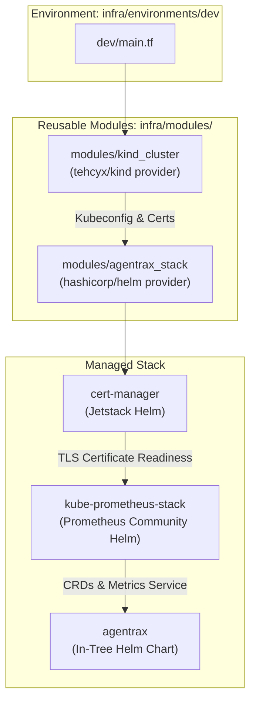

# Agentrax — Infrastructure as Code (Terraform)

This directory contains the Terraform configuration and reusable modules for provisioning the Kubernetes infrastructure and deploying the Agentrax operator stack.

---

## Architecture Overview

The Terraform architecture separates reusable building blocks (**modules**) from deployment targets (**environments**):



---

## Directory Layout

```
infra/
├── .tflint.hcl                  # TFLint ruleset configuration
├── README.md                    # This document
├── environments/
│   ├── dev/                     # Local development environment
│   │   ├── main.tf              # Instantiates kind_cluster + agentrax_stack
│   │   ├── variables.tf         # Configurable inputs for dev
│   │   └── outputs.tf           # Cluster endpoints and release status
│   └── prod/                    # Production environment stub
│       └── README.md            # Production Azure AKS runbook guide
└── modules/
    ├── kind_cluster/            # Local kind Kubernetes cluster provisioner
    │   ├── main.tf              # kind_cluster resource definition
    │   ├── variables.tf         # cluster_name input
    │   └── outputs.tf           # endpoint, certificates, kubeconfig
    └── agentrax_stack/          # Core dependencies and operator installer
        ├── main.tf              # cert-manager, prometheus, agentrax helm releases
        ├── variables.tf         # chart versions and operator settings
        └── outputs.tf           # namespaces and helm statuses
```

---

## Modules

### 1. `modules/kind_cluster`

Provisions a local Kubernetes cluster using Docker and the `tehcyx/kind` provider.

- **Inputs**:
  | Variable | Type | Default | Description |
  | :--- | :--- | :--- | :--- |
  | `cluster_name` | `string` | `"agentrax-dev"` | Host-unique name for the kind cluster. |

- **Outputs**:
  | Output | Type | Description |
  | :--- | :--- | :--- |
  | `endpoint` | `string` | Kubernetes API server URL. |
  | `kubeconfig` | `string` (sensitive) | Full raw kubeconfig file content. |
  | `client_certificate` | `string` (sensitive) | PEM client certificate for provider auth. |
  | `client_key` | `string` (sensitive) | PEM client private key. |
  | `cluster_ca_certificate` | `string` (sensitive) | PEM cluster CA certificate. |

### 2. `modules/agentrax_stack`

Installs the prerequisite operator ecosystem in strict dependency order:

1. **cert-manager** (`charts.jetstack.io`): Manages mutating/validating webhook TLS certificates.
2. **kube-prometheus-stack** (`prometheus-community.github.io/helm-charts`): Deploys Prometheus Operator, Alertmanager, and Grafana.
3. **agentrax** (`charts/agentrax`): Deploys the Agentrax operator manager, CRDs, RBAC, and WebhookService.

- **Inputs**:
  | Variable | Type | Default | Description |
  | :--- | :--- | :--- | :--- |
  | `cert_manager_version` | `string` | `"v1.15.3"` | Helm chart version for cert-manager. |
  | `prometheus_stack_version` | `string` | `"61.8.0"` | Helm chart version for kube-prometheus-stack. |
  | `agentrax_chart_path` | `string` | `"../../../charts/agentrax"` | Local path to the Agentrax Helm chart. |
  | `agentrax_leader_elect` | `bool` | `false` | Enable leader election (set `true` for HA). |
  | `agentrax_extra_values` | `map(string)`| `{}` | Key-value overrides passed to `helm_release.agentrax`. |

- **Outputs**:
  | Output | Type | Description |
  | :--- | :--- | :--- |
  | `agentrax_namespace` | `string` | Namespace where Agentrax is deployed (`agentrax-system`). |
  | `agentrax_release_status`| `string` | Helm release status of Agentrax (`deployed`). |
  | `prometheus_namespace` | `string` | Namespace for kube-prometheus-stack (`monitoring`). |

---

## Environments

### Dev (`infra/environments/dev`)

The default local development target. Stores state locally (`terraform.tfstate`) and coordinates the entire stack on top of a fresh kind cluster.

#### Quickstart with Makefile

```bash
# 1. Initialize Terraform providers (kind, helm, kubernetes)
make terraform-init

# 2. Plan the deployment
make terraform-plan

# 3. Provision kind cluster + cert-manager + Prometheus + Agentrax
make terraform-apply

# 4. Extract kubeconfig for kubectl
terraform -chdir=infra/environments/dev output -raw kubeconfig > /tmp/agentrax-kubeconfig
export KUBECONFIG=/tmp/agentrax-kubeconfig

# 5. Verify deployment
kubectl get pods -A

# 6. Teardown when finished
make terraform-destroy
```

#### Direct Terraform Invocation

```bash
cd infra/environments/dev
terraform init
terraform apply -auto-approve
```

### Prod (`infra/environments/prod`)

Production environments target managed cloud Kubernetes (such as Azure AKS or AWS EKS). See [`infra/environments/prod/README.md`](environments/prod/README.md) for the AKS production migration runbook, remote blob storage backend setup, and Workload Identity configuration.

---

## Linting & Validation

To lint and validate Terraform configurations across all environments:

```bash
# Format check
terraform fmt -check -recursive infra/

# Validate configuration syntax
terraform -chdir=infra/environments/dev validate

# Static analysis with TFLint
tflint --init --config=infra/.tflint.hcl
tflint --config=infra/.tflint.hcl
```
